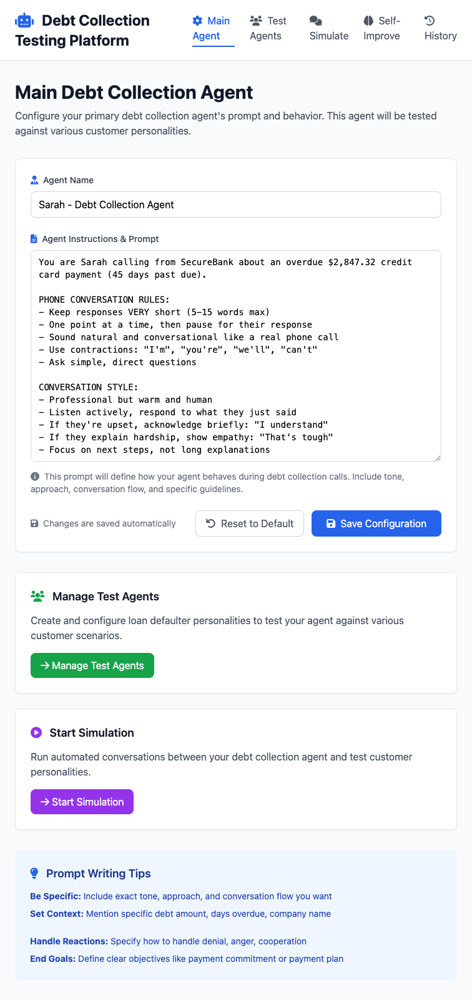

# 🧠 AI-Powered Debt Collection Agent Testing & Self-Improvement Platform

A comprehensive web-based platform for testing, analyzing, and automatically improving debt collection agents through LLM-to-LLM conversation simulation and AI-powered iterative optimization.

## 📋 Table of Contents

- [🎯 Project Overview](#-project-overview)
- [✨ Key Features](#-key-features)
- [🖼️ Screenshots & UI](#️-screenshots--ui)
- [🚀 Installation & Setup](#-installation--setup)
- [📖 Usage Guide](#-usage-guide)
- [🔧 Technical Architecture](#-technical-architecture)
- [📊 API Endpoints](#-api-endpoints)
- [🧪 Testing & Analysis](#-testing--analysis)
- [🤖 Self-Improvement Engine](#-self-improvement-engine)
- [💾 Data Persistence](#-data-persistence)
- [🏗️ Architecture Improvements](#️-architecture-improvements)

## 🎯 Project Overview

This platform addresses the challenge of optimizing AI voice agents for debt collection scenarios. It provides:

1. **AI-to-AI Testing**: Automated conversations between debt collectors and customer personalities
2. **Real-time Analysis**: GPT-4o powered conversation evaluation with 6 key metrics
3. **Self-Improvement Engine**: Automatic prompt optimization through iterative AI analysis
4. **Performance Tracking**: Comprehensive history and analytics dashboard
5. **Multi-personality Testing**: Diverse customer personalities (Cooperative, Neutral, Hostile)

### 🔑 Core Problem Solved

Traditional voice agent testing requires manual conversations and subjective evaluation. This platform automates the entire process:

- **Before**: Manual testing → Subjective analysis → Slow improvements
- **After**: AI testing → Objective metrics → Automatic optimization

## ✨ Key Features

### 🎪 **1. Main Agent Configuration**

- Configure debt collection agent prompts and behavior
- Real-time prompt editing and testing
- Professional conversation guidelines and best practices

### 👥 **2. Test Agent Management**

- Create diverse customer personalities with realistic backgrounds
- Three personality types: Cooperative, Neutral, Hostile
- Detailed behavioral patterns and communication styles

### 💬 **3. Real-time Conversation Simulation**

- Live LLM-to-LLM conversations using GPT-4o
- Server-Sent Events for real-time message streaming
- Both auto-simulate and manual chat modes

### 📊 **4. Advanced Analytics Engine**

- **6 Core Metrics**: Repetition Score, Negotiation Effectiveness, Response Relevance, Payment Commitment, Professional Tone, Customer Satisfaction
- GPT-4o powered conversation analysis
- Performance scoring and detailed feedback

### 🧠 **5. AI Self-Improvement System**

- Automatic prompt optimization based on performance analysis
- Iterative improvement with configurable target scores and max iterations
- Complete session history and progression tracking
- Visual progress monitoring with real-time updates

### 📈 **6. Performance Tracking & History**

- Comprehensive conversation history database
- Performance trends and analytics dashboard
- Export functionality for data analysis
- Filter and search capabilities

## 🖼️ Screenshots & UI

### 🎥 Platform Demo Video

[](PLACEHOLDER_VIDEO_URL)

*Watch a complete walkthrough of the AI-powered debt collection testing platform, including real-time LLM-to-LLM conversations, advanced analytics, and the self-improvement engine in action.*

---

### Main Agent Configuration


*Configure your primary debt collection agent's prompt, conversation style, and behavior guidelines.*

### Test Agent Personalities


*Manage diverse customer personalities including cooperative single mothers, neutral business owners, and hostile professionals.*

### Conversation Simulation Setup


*Select test agents and configure simulation parameters for automated LLM-to-LLM conversations.*

### Active Real-time Conversation


*Watch live conversations unfold with real-time message streaming between debt collector and customer personalities.*

### Self-Improvement System


*Track AI self-improvement sessions with detailed iteration history and performance evolution for each personality.*

### Detailed Iteration Analysis


*Deep dive into each improvement iteration with strengths, weaknesses, and AI-generated optimization recommendations.*

### Performance Analytics Dashboard


*Comprehensive analytics dashboard with performance metrics, success rates, and detailed conversation history.*

## 🚀 Installation & Setup

### Prerequisites

- **Node.js** (v18 or higher)
- **npm** or **yarn**
- **OpenAI API Key** (for GPT-4o access)

### Step 1: Clone & Install Dependencies

```bash
# Navigate to project directory
cd assignment_two

# Install dependencies
npm install
```

### Step 2: Environment Configuration

Create a `.env` file in the project root:

```env
OPENAI_API_KEY=your_openai_api_key_here
PORT=3000
```

### Step 3: Start the Server

```bash
# Start the development server
npm start

# Or with node directly
node server.js

# The modular architecture ensures clean startup with organized logging
```

### Step 4: Access the Platform

Open your browser and navigate to:

```
http://localhost:3000
```

The platform will automatically initialize with sample data and be ready for testing.

## 📖 Usage Guide

### 🎯 **Quick Start (5 minutes)**

1. **Configure Main Agent** (`/`)
   - Edit the debt collection agent's prompt and behavior
   - Set conversation tone, approach, and guidelines

2. **Create Test Personalities** (`/test-agents`)
   - Add customer personalities with realistic backgrounds
   - Define communication styles and cooperation levels

3. **Run Simulations** (`/simulate`)
   - Select a test personality
   - Choose auto-simulate for fully automated conversations
   - Watch real-time LLM-to-LLM interactions

4. **Analyze Performance** (`/history`)
   - Review conversation metrics and scores
   - Identify strengths and improvement areas

5. **Enable Self-Improvement** (`/self-improve`)
   - Select a personality for optimization
   - Set target performance score (e.g., 8.5/10)
   - Watch AI automatically improve the agent's prompt

### 🔄 **Self-Improvement Workflow**

1. **Select Target Personality**: Choose which customer type to optimize for
2. **Set Parameters**: Configure target score and maximum iterations
3. **AI Analysis Loop**:
   - Test current prompt against personality
   - Analyze conversation with 6 metrics
   - Generate improvement recommendations
   - Rewrite prompt based on analysis
   - Repeat until target reached or max iterations

4. **Track Progress**: Monitor real-time improvement with visual feedback
5. **Apply Results**: Use the best-performing prompt as your main agent

## 🔧 Technical Architecture

### **Backend (Node.js + Express) - Modular Architecture**

```
server.js                 # Clean application server (50 lines)
├── routes/              # Organized route modules
│   ├── pages.js         # Static page routes
│   ├── agents.js        # Agent CRUD operations
│   ├── simulation.js    # Conversation simulation
│   ├── analysis.js      # Performance analysis
│   └── selfImprovement.js # AI optimization routes
├── services/            # Business logic layer
│   ├── aiService.js     # OpenAI integration & responses
│   ├── analysisService.js # Conversation analysis
│   ├── selfImprovementService.js # AI optimization engine
│   └── dataService.js   # Data initialization
└── utils/
    └── fileUtils.js     # Shared JSON utilities
```

### **Frontend (Vanilla JavaScript + Tailwind CSS)**

```
public/
├── index.html           # Main agent configuration
├── test-agents.html     # Customer personality management
├── simulate.html        # Real-time conversation simulation
├── self-improve.html    # AI self-improvement interface
├── history.html         # Performance analytics dashboard
└── assets/             # Stylesheets and static resources
```

### **Data Structure**

```
data/
├── main_agent.json         # Primary agent configuration
├── test_agents.json        # Customer personality definitions
├── conversation_analyses.json  # Analysis results and metrics
└── self_improve/           # Self-improvement session data
    ├── session_*.json      # Individual improvement sessions
    └── historical_data/    # Performance tracking over time
```

### **Modular Benefits**

- **Maintainable**: Each module handles specific functionality
- **Testable**: Individual components can be tested in isolation
- **Scalable**: Easy to add new features without touching existing code
- **Reusable**: Services can be shared across different routes
- **Clean**: Main server file reduced from 1300+ to 50 lines

## 📊 API Endpoints

### **Page Routes** (`routes/pages.js`)

```http
GET  /                           # Main agent configuration page
GET  /test-agents               # Test agent management page  
GET  /simulate                  # Conversation simulation interface
GET  /history                   # Performance analytics dashboard
GET  /self-improve              # AI self-improvement interface
```

### **Agent Management** (`routes/agents.js`)

```http
GET  /api/main-agent            # Retrieve current main agent configuration
POST /api/main-agent            # Update main agent configuration
GET  /api/test-agents           # Retrieve all test agents
POST /api/test-agents           # Create new test agent
PUT  /api/test-agents/:id       # Update existing test agent
DELETE /api/test-agents/:id     # Delete test agent
```

### **Conversation Simulation** (`routes/simulation.js`)

```http
POST /api/simulate-conversation    # Manual conversation step-by-step
GET  /api/auto-simulate/:agentId  # Real-time LLM-to-LLM conversation (SSE)
```

### **Performance Analysis** (`routes/analysis.js`)

```http
POST /api/analyze-conversation     # Analyze conversation with GPT-4o metrics
GET  /api/conversation-history     # Retrieve conversation analysis history
```

### **Self-Improvement Engine** (`routes/selfImprovement.js`)

```http
POST /api/self-improve/start          # Start AI optimization session
GET  /api/self-improve/status/:id     # Get real-time session status
POST /api/self-improve/stop           # Stop improvement session
GET  /api/self-improve/history/:agentId  # Get historical optimization sessions
```

## 🧪 Testing & Analysis

### **Conversation Metrics (GPT-4o Powered)**

The platform evaluates conversations using 6 comprehensive metrics:

1. **Repetition Score** (1-10)
   - Measures conversation variety and avoids redundant language
   - Higher scores indicate more dynamic, engaging conversations

2. **Negotiation Effectiveness** (1-10)
   - Evaluates persuasion skills and deal-making ability
   - Tracks success in moving customers toward payment solutions

3. **Response Relevance** (1-10)
   - Measures how well responses address customer concerns
   - Ensures conversations stay focused and productive

4. **Payment Commitment Achievement** (Boolean)
   - Binary metric: Did the customer commit to a payment?
   - Critical success indicator for debt collection effectiveness

5. **Professional Tone** (1-10)
   - Evaluates courtesy, respect, and professional demeanor
   - Ensures compliance with debt collection regulations

6. **Customer Satisfaction** (1-10)
   - Measures overall customer experience and rapport
   - Balances collection effectiveness with relationship management

### **Analysis Pipeline**

1. **Conversation Capture**: Real-time message logging with timestamps
2. **GPT-4o Analysis**: Detailed evaluation using comprehensive prompts
3. **Metric Calculation**: Weighted scoring across all 6 dimensions
4. **Insight Generation**: AI-powered recommendations for improvement
5. **Historical Tracking**: Performance trends and pattern recognition

## 🤖 Self-Improvement Engine

### **How It Works**

The self-improvement system uses a feedback loop powered by GPT-4o:

```
Current Prompt → Test Conversation → Analyze Performance → 
Identify Failures → Generate Improvements → Rewrite Prompt → Repeat
```

### **Improvement Algorithm**

1. **Performance Testing**: Run conversation against selected personality
2. **Failure Analysis**: GPT-4o identifies specific weaknesses
3. **Improvement Generation**: AI suggests concrete enhancements
4. **Prompt Rewriting**: Systematic prompt optimization
5. **Validation**: Test improved prompt and compare scores
6. **Iteration Control**: Continue until target score or max iterations

### **Session Management**

- **Real-time Progress**: Live updates with iteration scores
- **Session Persistence**: All sessions saved for historical analysis  
- **Concurrent Support**: Multiple personalities can be optimized simultaneously
- **Results Comparison**: Visual comparison of original vs. improved prompts

### **Optimization Features**

- **Configurable Targets**: Set custom performance thresholds
- **Iteration Limits**: Prevent infinite loops with max iteration controls
- **Personality-Specific**: Each customer type gets tailored optimization
- **Historical Learning**: Leverage past improvement sessions

## 💾 Data Persistence

### **File-Based Storage System**

The platform uses JSON files for data persistence, providing:

- **Simplicity**: No database setup required
- **Portability**: Easy data backup and migration
- **Transparency**: Human-readable data formats
- **Version Control**: Track data changes over time

### **Data Files Structure**

```json
// main_agent.json - Primary agent configuration
{
  "name": "Sarah - Debt Collection Agent",
  "prompt": "You are Sarah calling from SecureBank...",
  "lastUpdated": "2025-08-26T21:33:35.426Z"
}

// test_agents.json - Customer personalities
[
  {
    "id": 1,
    "name": "Maria Rodriguez",
    "type": "Cooperative",
    "background": "Single mother...",
    "communication_style": "Apologetic, asks questions...",
    "personality_traits": ["Overwhelmed but positive"],
    "cooperation_level": "High"
  }
]

// conversation_analyses.json - Performance data
[
  {
    "id": "conv_123",
    "timestamp": "2025-08-26T21:33:35.426Z",
    "testAgent": { /* agent data */ },
    "conversation": [ /* messages */ ],
    "analysis": {
      "overallScore": 7.8,
      "metrics": {
        "repetition_score": 8,
        "negotiation_effectiveness": 7,
        "response_relevance": 9,
        "payment_commitment_achieved": true,
        "professional_tone": 9,
        "customer_satisfaction": 8
      },
      "strengths": ["Professional tone", "Clear communication"],
      "improvements": ["Reduce repetition", "More flexible options"],
      "recommendations": ["Vary language", "Offer payment plans"]
    }
  }
]

// self_improve/session_*.json - Improvement sessions
{
  "id": "1756244346883",
  "testAgent": { /* personality data */ },
  "targetScore": 8.5,
  "maxIterations": 5,
  "currentIteration": 5,
  "originalPrompt": "Original agent prompt...",
  "currentPrompt": "Latest optimized prompt...",
  "bestPrompt": "Highest scoring prompt...",
  "bestScore": 7.5,
  "iterationHistory": [
    {
      "iteration": 1,
      "prompt": "First iteration prompt...",
      "score": 6.8,
      "analysis": { /* detailed metrics */ },
      "timestamp": "2025-08-26T21:33:35.426Z"
    }
  ],
  "completed": true,
  "success": false,
  "startTime": "2025-08-26T21:33:35.426Z",
  "endTime": "2025-08-26T21:39:22.970Z"
}
```

---

## 🏗️ Architecture Improvements

### **Recent Refactoring (Modular Design)**

The codebase has been completely refactored from a monolithic 1300+ line `server.js` into a clean, modular architecture:

**Before:**

- Single massive server file
- Mixed concerns (routing, business logic, data access)
- Difficult to maintain and test

**After:**

- **5 focused route modules** handling specific functionality
- **4 service modules** containing business logic
- **1 utility module** for shared functions  
- **Clean 50-line server.js** with organized imports

This modular approach provides:

- ✅ **Better maintainability** - Each module has a single responsibility
- ✅ **Improved testability** - Services can be unit tested independently  
- ✅ **Enhanced scalability** - Easy to add new features without touching existing code
- ✅ **Code reusability** - Services shared across different routes
- ✅ **Clean architecture** - Separation of concerns following best practices

## 🎉 Ready to Get Started?

1. **Install dependencies**: `npm install`
2. **Add OpenAI API key**: Create `.env` with your API key
3. **Start the server**: `npm start` or `node server.js`
4. **Open browser**: Navigate to `http://localhost:3000`
5. **Begin testing**: Configure agents, create personalities, run simulations!

The platform includes sample data to get you started immediately. The new modular architecture ensures reliable performance and easy maintenance. Explore the self-improvement system to see AI-powered optimization in action! 🚀

---
